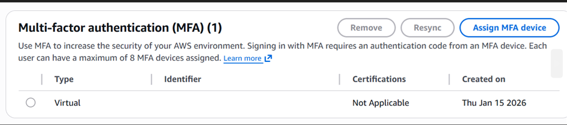

# AWS Cloud Basics: Security & Cost Governance

## 📌 Project Context
When launching any cloud infrastructure, the two most critical risks are root account compromise and unexpected costs due to misconfiguration. This lab establishes the initial **Landing Zone** following the **AWS Well-Architected Framework** best practices (Security and Cost Optimization pillars).

## 🎯 Business Goals
1. **Mitigate Intrusion Risk:** Protect the Root account against unauthorized access.
2. **Access Delegation:** Eliminate the need to use the root account for daily operations.
3. **Financial Governance:** Establish automated alerts to prevent accidental billing (Cost Avoidance).

## 🛠️ Services Used
* **AWS IAM (Identity and Access Management):** Identity management and access policies.
* **AWS Budgets:** Cost monitoring and billing alerts.
* **MFA (Multi-Factor Authentication):** Additional security layer.

## 🚀 Technical Implementation

### 1. Root Account Hardening (MFA)
The root user has unlimited access. To protect it, Multi-Factor Authentication (MFA) was enabled, requiring a secondary physical/virtual device to sign in, neutralizing password phishing attacks.

### 2. Identity Management (IAM User)
Following the security principle of **not using the root account for daily tasks**, a dedicated IAM user with `AdministratorAccess` was created.
* **Why:** It enables activity logging (CloudTrail) and allows access revocation without compromising the entire account.

### 3. Cost Control (AWS Budgets)
A "Zero Spend Budget" alarm was configured.
* **Configuration:** Email alert if forecasted costs exceed $0.01 USD.
* **Benefit:** Allows immediate reaction to forgotten resources (e.g., running EC2 instances) before they generate a significant bill.

## 💡 Key Takeaways
This lab laid the operational foundation of the account. I learned that cloud security is a shared responsibility and that proactive billing alerts are a mandatory first step before deploying any compute resources.
