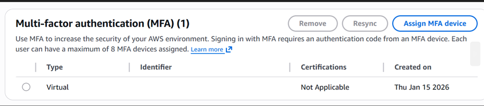
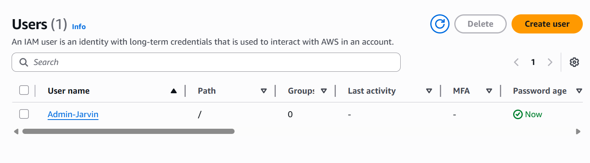
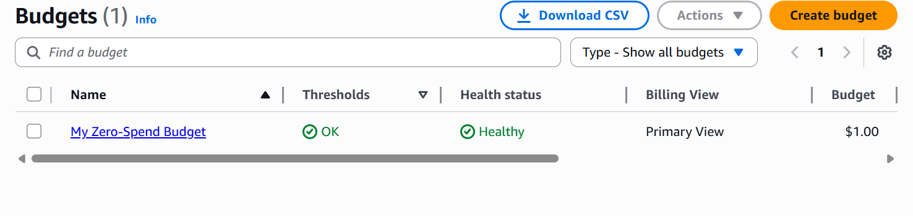

# AWS Cloud Basics: Seguridad y Gobernanza de Costos

## 📌 Contexto del Proyecto
Al iniciar cualquier infraestructura en la nube, los dos riesgos más críticos son el compromiso de seguridad de la cuenta raíz y los costos imprevistos por errores de configuración. Este laboratorio establece la "Landing Zone" inicial siguiendo las mejores prácticas del **AWS Well-Architected Framework** (Pilares de Seguridad y Optimización de Costos).

## 🎯 Objetivos de Negocio
1. **Mitigar el riesgo de intrusión:** Proteger la cuenta raíz (Root) contra accesos no autorizados.
2. **Delegación de accesos:** Eliminar la necesidad de usar la cuenta raíz para operaciones diarias.
3. **Gobernanza financiera:** Establecer alertas automatizadas para prevenir la facturación accidental (Cost Avoidance).

## 🛠️ Servicios Implementados
* **AWS IAM (Identity and Access Management):** Gestión de identidades y políticas de acceso.
* **AWS Budgets:** Monitoreo de costos y alertas de facturación.
* **MFA (Multi-Factor Authentication):** Capa de seguridad adicional.
  

## 🚀 Implementación Técnica

### 1. Fortalecimiento de la Cuenta Raíz (MFA)
El usuario raíz tiene acceso ilimitado a todos los recursos y facturación. Para protegerlo, se activó la autenticación multifactor (MFA), lo que requiere un dispositivo físico/virtual secundario para iniciar sesión, neutralizando ataques de phishing de contraseñas.

### 2. Gestión de Identidad (IAM User)
Siguiendo el principio de seguridad de **no utilizar la cuenta raíz para tareas cotidianas**, se creó un usuario IAM dedicado con permisos de Administrador (`AdministratorAccess`).
* **Por qué:** Permite trazabilidad (logs) de quién hace qué cambios y permite revocar acceso sin comprometer la cuenta entera.

### 3. Control de Costos (AWS Budgets)
Se configuró una alarma de presupuesto de "Cero Gasto" (Zero Spend Budget).
* **Configuración:** Alerta vía email si el costo pronosticado supera $0.01 USD.
* **Beneficio:** Permite reacción inmediata ante recursos olvidados (ej: una instancia EC2 encendida) antes de que generen una factura significativa.

## 💡 Conclusiones y Aprendizaje
Este laboratorio sentó las bases operativas de la cuenta. Aprendí que la seguridad en la nube es responsabilidad compartida y que la configuración proactiva de alertas de facturación es el primer paso obligatorio antes de desplegar cualquier recurso computacional.
