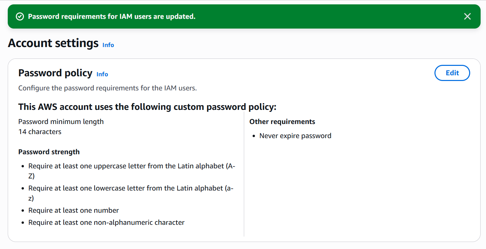

# Module 01: Identity & Access Management (IAM) Hardening 🔐

## 📋 Executive Summary
This module focuses on securing the **Identity Perimeter** of the AWS environment. In modern cloud architecture, identity is the first line of defense. The goal of this implementation is to establish a robust authentication and authorization framework, moving from insecure defaults to a "Secure by Design" posture following **CIS AWS Foundations Benchmarks**.

## 🎯 Key Objectives
* **Eliminate Root User Usage:** Transition daily operations from the root account to individual IAM users.
* **Enforce Strong Authentication:** Implement Multi-Factor Authentication (MFA) for privileged accounts to prevent credential compromise.
* **Implement RBAC (Role-Based Access Control):** Manage permissions via Groups rather than attaching policies directly to users, ensuring scalability and auditability.
* **Compliance:** Configure password policies that meet strict complexity requirements.

## ⚙️ Implementation Details

### 1. Root Account Securitization
The "Root User" has unrestricted access to the entire AWS account. To mitigate the risk of account takeover:
* **MFA Activation:** Virtual MFA (Multi-Factor Authentication) was enabled on the root account to add a second layer of security.
* **Access Keys Removal:** No programmatic access keys (Access Key ID / Secret Access Key) were created for the root user, preventing API-based attacks.

### 2. Password Policy Enforcement
A strict password policy was configured to prevent brute-force attacks and credential stuffing.
* **Minimum Length:** 14 characters.
* **Complexity:** Requires uppercase, lowercase, numbers, and symbols.
* **Rotations:** Users are permitted to change their own passwords.




### 3. Role-Based Access Control (RBAC) Architecture
Instead of attaching the `AdministratorAccess` policy directly to a user (which is an anti-pattern), I created a managed group structure:
* **Group Name:** `Security_Admins`
* **Attached Policy:** `AdministratorAccess` (AWS Managed)
* **User:** Created a dedicated admin user (`Ing_Sistemas_Admin`) and assigned it to the group.
* **Benefit:** This allows for centralized permission management. If the user changes roles, they are simply removed from the group.


### 4. JSON Policy Analysis
During the setup, I analyzed AWS JSON policy structures to understand the anatomy of permissions:
```json
{
    "Version": "2012-10-17",
    "Statement": [
        {
            "Effect": "Allow",
            "Action": "*",
            "Resource": "*"
        }
    ]
}
´´´
I identified that while necessary for initial setup, the AdministratorAccess policy violates the Principle of Least Privilege and should be restricted in production environments.

🛠️ Skills Demonstrated
AWS IAM: User, Group, and Policy management.

Security Hardening: MFA implementation and Root account protection.

Compliance: Password complexity enforcement.

Access Control: RBAC principles.

Module completed by: Jarvin Navas
