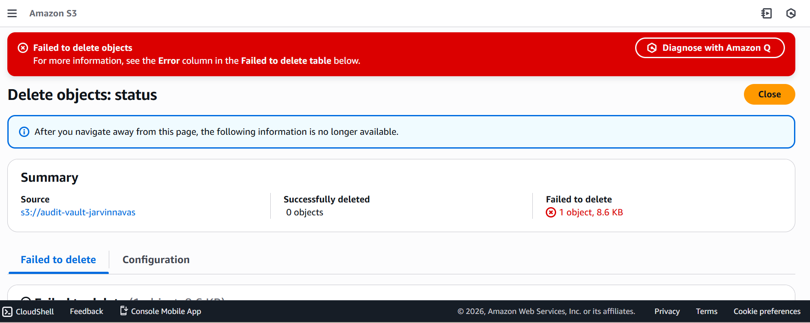
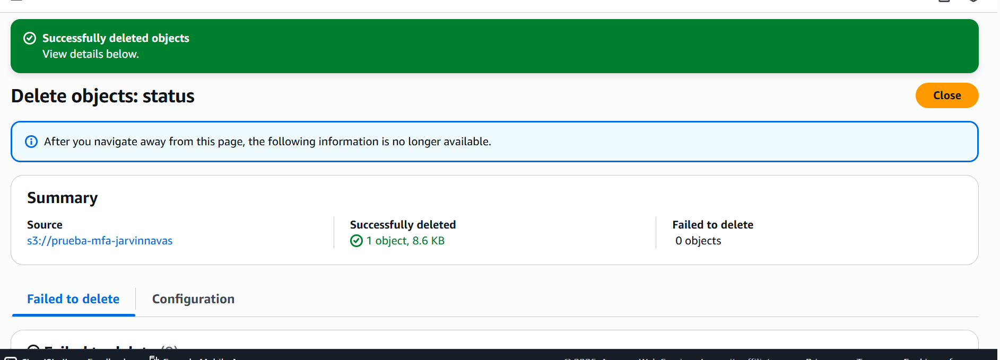

# Phase 2 - Module 01: IAM Advanced Policy (MFA Enforcement) 🛡️

## 📋 Scenario
Standard IAM policies often allow destructive actions (like `DeleteObject`) based solely on user identity. If credentials are compromised, attackers can wipe critical data. In this module, I implemented a **Zero Trust** approach using **IAM Condition Keys** to enforce Multi-Factor Authentication for sensitive operations.

## 🎯 Objectives
* **Enforce MFA:** Deny destructive actions (Delete) unless the session is authenticated with a valid MFA token.
* **Explicit Deny Logic:** Use the `Deny` effect with the `aws:MultiFactorAuthPresent` condition to override any existing allow permissions.

## 📸 Evidence of Execution

### 1. The Block (Attack Simulation)
First, I attempted to delete a file using valid user credentials but **without** an active MFA session token. The policy correctly triggered an `Access Denied` error, blocking the potential threat.



### 2. The Success (Authorized Access)
After authenticating with the MFA device (updating the session token), the condition `aws:MultiFactorAuthPresent` became "true", and the deletion was permitted successfully.



## 🛡️ Value Added
This configuration ensures that even if an attacker steals long-term credentials (password or access keys), they cannot perform irreversible actions like data deletion without physical access to the MFA device.

---

## ⚙️ Appendix: Technical Implementation

Below is the **JSON Policy** applied to the user. Note the explicit `Deny` block at the end using the Condition Key.

```json
{
    "Version": "2012-10-17",
    "Statement": [
        {
            "Sid": "AllowS3Operations",
            "Effect": "Allow",
            "Action": [
                "s3:ListAllMyBuckets",
                "s3:GetBucketVersioning",
                "s3:ListBucket",
                "s3:GetBucketLocation",
                "s3:GetObject",
                "s3:PutObject",
                "s3:DeleteObject"
            ],
            "Resource": "*"
        },
        {
            "Sid": "DenyDeleteWithoutMFA",
            "Effect": "Deny",
            "Action": "s3:DeleteObject",
            "Resource": "*",
            "Condition": {
                "BoolIfExists": {
                    "aws:MultiFactorAuthPresent": "false"
                }
            }
        }
    ]
}
Module completed by: Jarvin Navas
