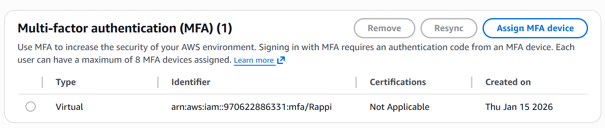
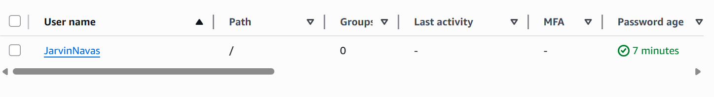
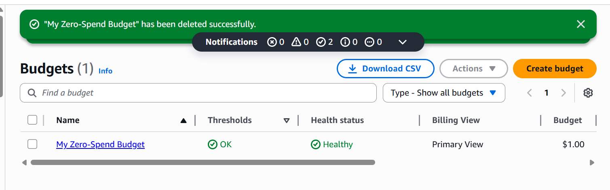

# Module 01: Identity, Access, and Core Account Security 🛡️

## 📋 Scenario
The AWS Root account holds absolute power over the entire environment. If compromised, attackers typically deploy hundreds of expensive resources (like EC2 instances for crypto-jacking), leading to massive financial loss and data breaches. 

In this first module, I established the foundational security posture of the AWS account by securing the Root user, migrating daily operations to a dedicated IAM Admin, and implementing proactive financial monitoring.

## 🎯 Objectives
* **Root Account Hardening:** Neutralize the risk of Root credential theft.
* **Principle of Least Privilege (Foundational):** Stop using the Root account for daily administrative tasks.
* **Anomaly Detection:** Implement automated alerts for unauthorized resource consumption (Crypto-jacking mitigation).

## ⚙️ Implementation Details & Evidence

### 1. Root Account MFA Enforcement
I enforced Multi-Factor Authentication (MFA) on the Root account using a virtual authenticator app. This ensures that even if the root password is leaked or brute-forced, the attacker cannot access the account without the physical token.

### 2. IAM Administrator Creation
To adhere to AWS Best Practices, I created a dedicated IAM user (`Ing_Sistemas_Admin`) with `AdministratorAccess`. Going forward, the Root account will be locked away and only used for specific, restricted tasks (like changing support plans or closing the account).

### 3. Financial Security (AWS Budgets)
To detect potential unauthorized access or compromised access keys quickly, I configured an **AWS Budget** alert. If the monthly estimated charges exceed a baseline threshold ($10 USD), an automated email alert is triggered to my security team (personal email), allowing for rapid incident response before the bill escalates.

## 🛡️ Value Added
* **Blast Radius Reduction:** By not using the Root account, we limit the potential damage of a session hijacking.
* **Proactive Defense:** The budget alert acts as a tripwire. Hackers often bypass initial logging, but they cannot hide the billing spikes from AWS Budgets.

---
*Module completed by: [Jarvin Navas]*
