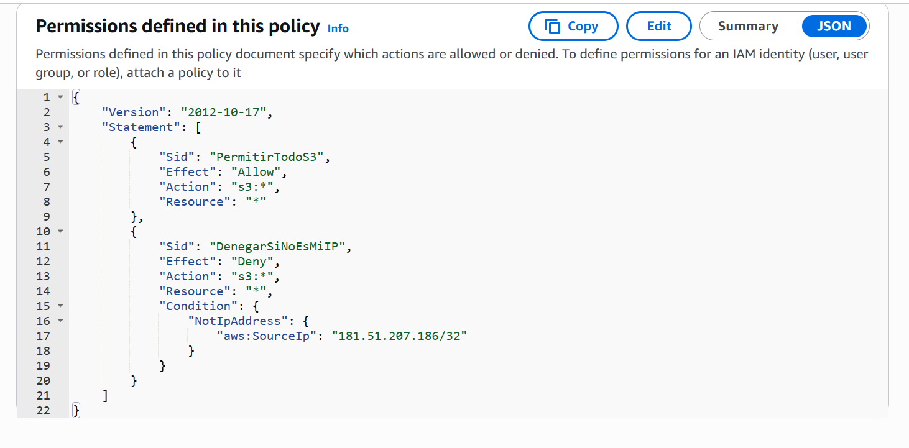
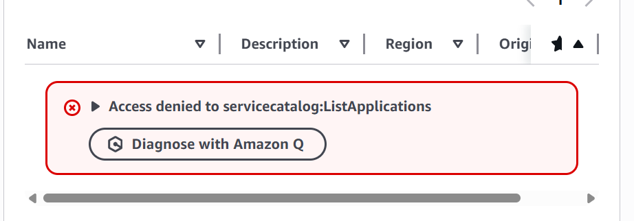

# Module 02: Advanced IAM Policies & IP-Based Access Control 🛡️

## 📋 Scenario
Standard username/password authentication is vulnerable to credential theft (e.g., via phishing or malware). If an attacker steals access keys or session tokens, they can access the environment from anywhere in the world. 

To mitigate this, I implemented a **Defense in Depth** strategy using Context-Based Access Control. Even if credentials are compromised, they are rendered useless if the request does not originate from a trusted corporate IP address.

## 🎯 Objectives
* **Customer Managed Policies:** Move away from AWS managed policies to write custom, least-privilege JSON policies.
* **Contextual Security (Condition Keys):** Restrict API actions based on the source IP address.
* **Explicit Deny Logic:** Utilize the `Deny` effect to override any potential `Allow` permissions if security conditions are not met.

## ⚙️ Implementation Details & Evidence

### 1. The Custom JSON Policy (Zero Trust approach)
I created a policy named `S3-IP-Restriction-Policy`. The policy architecture explicitly allows S3 actions but includes an overriding `Deny` statement triggered by the `aws:SourceIp` condition key. 

*If the connection does not come from the authorized IP (/32), all access is blocked.*

### 2. Attack Simulation & Validation
To validate the control, I simulated an attack by attempting to access the S3 console from an unauthorized IP address using valid user credentials (`Dev_S3_Test`). 

As expected, the AWS IAM evaluation logic triggered the Explicit Deny. The console failed to load resources and immediately returned **Access Denied** API errors, successfully preventing unauthorized data access.

## 🛡️ Value Added
* **Credential Leak Mitigation:** Stolen credentials cannot be exploited outside the trusted network perimeter.
* **Granular Control:** Demonstrates the ability to lock down sensitive resources (like S3 buckets) not just by *who* is accessing them, but *from where* they are accessing them.

---
*Module completed by: [Jarvin Navas]*
