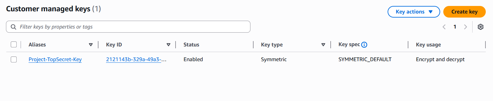
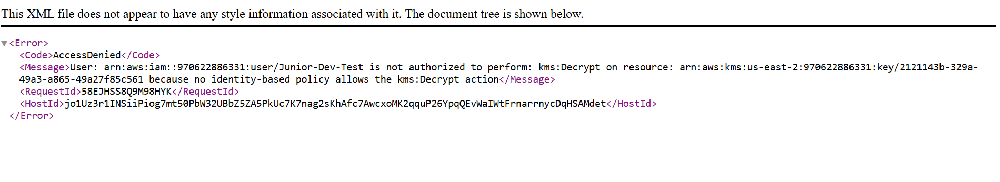

# Phase 2 - Module 02: Data Encryption (AWS KMS) 🔐

## 📋 Scenario
In a standard environment, an S3 Admin can read all data. However, for sensitive departments (like HR or Finance), we need **Separation of Duties**. The storage admin should manage the files but NOT read their content.

## 🎯 Objectives
* **Customer Managed Keys (CMK):** Create a dedicated encryption key controlled by us, not AWS.
* **Separation of Duties:** Prove that a user with full S3 access cannot read a file if they lack the specific KMS decryption permission.

## ⚙️ Implementation Details

### 1. The Key Architecture
I created a Symmetric KMS Key (`Project-TopSecret-Key`) and defined a strict **Key Policy**:
* **Key Admin:** `Ing_Sistemas_Admin`
* **Allowed Users:** `Ing_Sistemas_Admin` ONLY.
* **Excluded Users:** `Junior-Dev-Test`.

### 2. The Verification (Access Denied)
I uploaded a sensitive file encrypted with this custom key. When the user `Junior-Dev-Test` (who has S3 Read permissions) tried to download the file, AWS blocked the request at the cryptographic layer.

**The Error:** `User is not authorized to perform: kms:Decrypt`.

## 🛡️ Value Added
This implements a **Defense in Depth** strategy. Even if an attacker compromises the S3 storage permissions, the data remains cryptographically secure and unreadable without the separate KMS key.

---
*Module completed by: Jarvin Navas*
