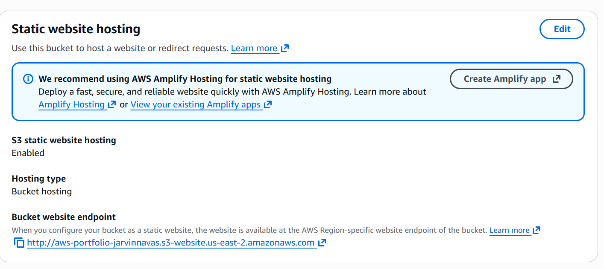
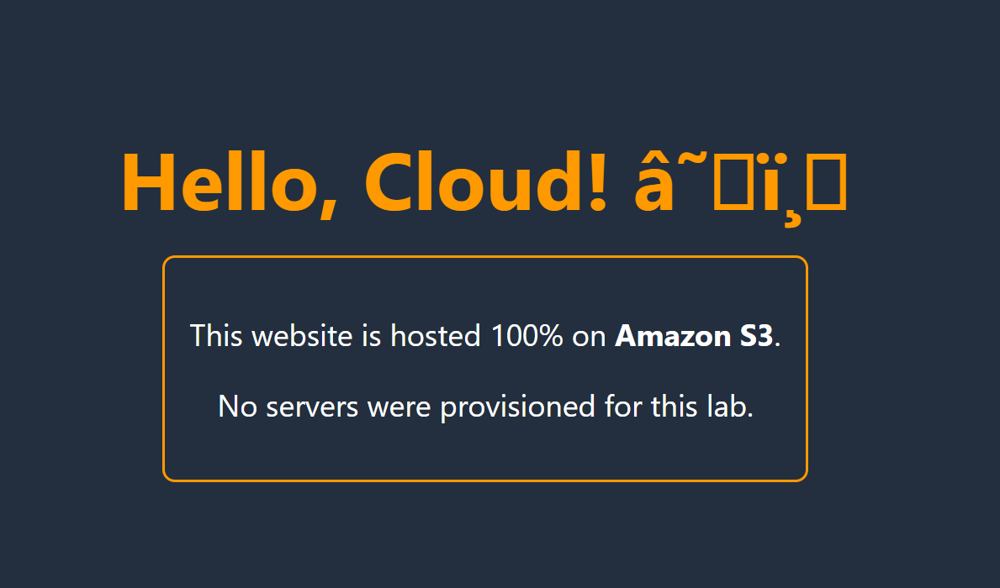

# Lab: Static Website Hosting on Amazon S3

## 📌 Project Overview
Deploying a high-availability website traditionally requires provisioning servers (EC2), configuring web server software (Apache/Nginx), and managing load balancers. In this lab, I utilized **Amazon S3 (Simple Storage Service)** to host a static website using a serverless architecture.

## 🎯 Business Goals
1.  **Reduce Operational Overhead:** Eliminate the need to patch or manage Operating Systems (OS).
2.  **Cost Optimization:** Move from an hourly compute cost model (EC2) to a storage-only pay-per-use model.
3.  **Scalability:** Leverage S3's native ability to handle varying levels of traffic without manual intervention.

## 🛠️ Architecture & Services
* **Amazon S3:** Object storage used to host HTML/CSS files.
* **Bucket Policy:** JSON configuration to allow public `GetObject` access.

## 🚀 Implementation Steps

### 1. Bucket Creation & Configuration
Created a unique S3 bucket in the `us-east-1` region.
* **Key Action:** Disabled "Block All Public Access" to allow internet traffic.

### 2. Static Website Hosting
Enabled the S3 static website hosting feature, transforming the storage bucket into a web server endpoint.


*(Screenshot of the Properties tab showing Static Website Hosting enabled)*
Also you can see the webiste in the browser

### 3. Permissions Management (Bucket Policy)
Applied a resource-based policy to explicitly grant `s3:GetObject` permission to any anonymous user (`Principal: *`). This step is crucial; without it, the public endpoint returns a `403 Forbidden` error even if public access blocks are removed.

```json
{
    "Version": "2012-10-17",
    "Statement": [
        {
            "Sid": "PublicReadGetObject",
            "Effect": "Allow",
            "Principal": "*",
            "Action": "s3:GetObject",
            "Resource": "arn:aws:s3:::my-portfolio-bucket/*"
        }
    ]
}
