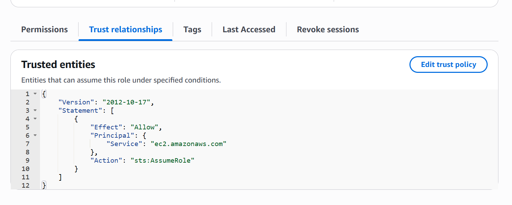

# Module 03: Machine Identities (IAM Roles) & Security Auditing 🛡️

## 📋 Scenario
A common critical vulnerability in cloud environments is hardcoding static credentials (Access Keys) into applications or servers (EC2). If a server is compromised, attackers can extract these long-term keys and pivot to other AWS services. Furthermore, without regular audits, security teams lose visibility over stale credentials and missing MFA enforcement.

In this module, I implemented **IAM Roles** for machine-to-machine authentication (eliminating static keys) and generated an **IAM Credential Report** to audit the security posture of all human and machine identities.

## 🎯 Objectives
* **Secretless Architecture:** Replace long-term static IAM Access Keys with temporary, automatically rotating credentials using AWS Security Token Service (STS) and IAM Roles.
* **Identity Auditing:** Generate and analyze a comprehensive compliance report to identify security gaps (e.g., missing MFA, old passwords).

## ⚙️ Implementation Details & Evidence

### 1. Identity Auditing (Credential Report)
I generated a centralized IAM Credential Report. This CSV file acts as an essential compliance artifact, providing a snapshot of all users, their password age, MFA status, and active Access Keys. This allows the security team to enforce credential rotation policies.

### 2. Machine Identities (IAM Roles)
To secure server access, I created an IAM Role (`EC2-S3-ReadOnly-Role`) specifically designed for EC2 instances. 
I configured the **Trust Relationship (Trust Policy)** to strictly allow the `ec2.amazonaws.com` service to assume this role. This ensures that the EC2 instance can securely read from S3 using temporary, auto-rotated tokens, completely eliminating the need for hardcoded `.csv` access keys on the server.

## 🛡️ Value Added
* **Attack Surface Reduction:** By removing static keys, we eliminate the risk of keys being leaked in source code, logs, or compromised servers.
* **Compliance Readiness:** The credential report provides immediate visibility required for compliance frameworks like SOC2, ISO 27001, and PCI-DSS.

---
*Module completed by: [Jarvin Navas]*
