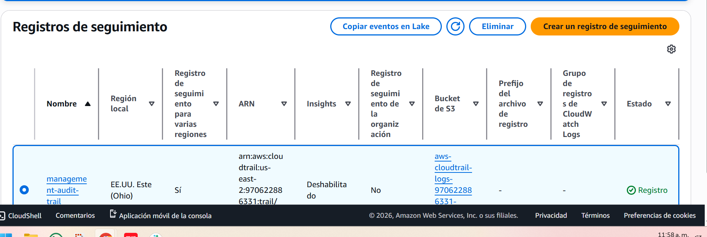
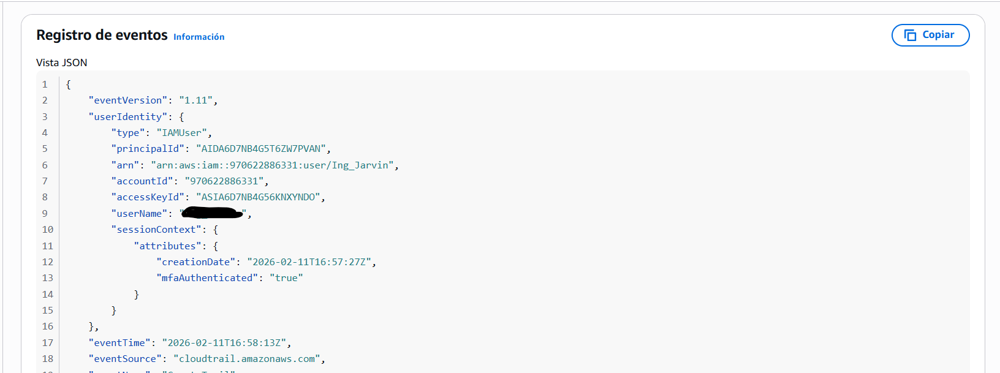

# Module 03: Logging & Auditing Infrastructure (CloudTrail) 👁️

## 📋 Overview
Visibility is the foundation of security. In this module, I implemented a centralized logging architecture using **AWS CloudTrail**. This creates an immutable audit trail of every action taken within the AWS environment, ensuring accountability and enabling forensic investigation.

## 🎯 Objectives
* **Centralized Logging:** Capture all API calls (Management Events) across the account.
* **Tamper Proofing:** Store logs in the immutable S3 vault created in Module 02.
* **Integrity Validation:** Enable cryptographic validation of log files to prove chain of custody.

## ⚙️ Implementation Details

### 1. The Trail Configuration
I configured a robust trail named `management-audit-trail` with the following parameters:
* **Scope:** All Management Events (Read/Write).
* **Storage:** Linked to the secure S3 Bucket (`audit-vault...`).
* **Validation:** Log File Validation enabled.

### 2. Forensic Analysis (Event History)
CloudTrail records the "Who, What, Where, When" of every request.
* **Who:** `userIdentity` (IAM User).
* **Where:** `sourceIPAddress` (Origin).
* **What:** `eventName` (e.g., ConsoleLogin, CreateBucket).

Below is an example of a captured event analyzed via the console:

## 🛡️ Value Added
This implementation satisfies the **"Detect"** function of the NIST Cybersecurity Framework. We can now answer the critical question: *"Who made that change?"*

---
*Module completed by: Jarvin Navas*
