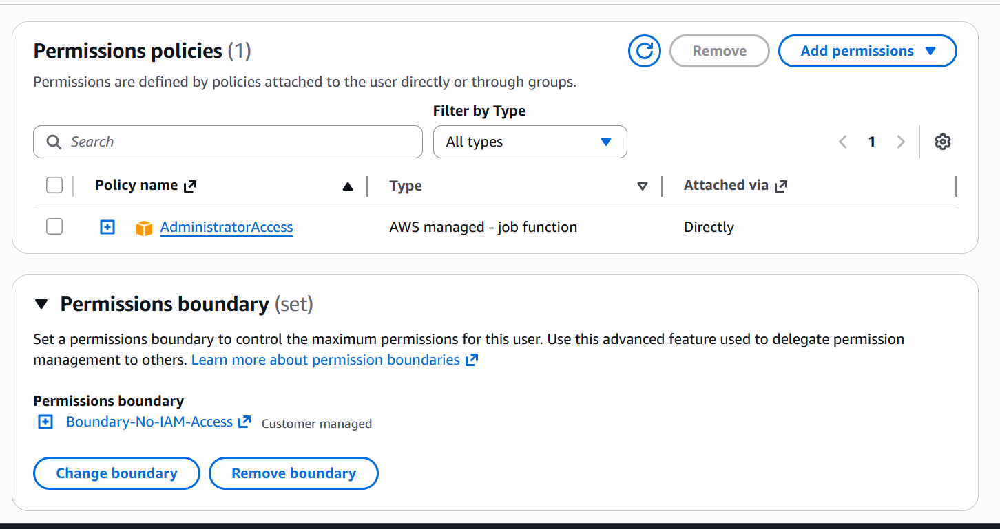

# Module 04: Advanced IAM Control (Permission Boundaries) 🛡️

## 📋 Scenario
In enterprise environments, delegating administrative rights is risky. If an administrator account is compromised, or if a rogue admin attempts malicious actions, they could create backdoor accounts or escalate privileges. 
To mitigate this, I implemented an **IAM Permissions Boundary** to act as an unpassable "glass ceiling," restricting the maximum allowable permissions of an administrator.

## 🎯 Objectives
* **Prevent Privilege Escalation:** Ensure that even a user with `AdministratorAccess` cannot modify IAM policies or create backdoor accounts.
* **Defense in Depth:** Apply a secondary layer of authorization evaluation that overrides explicit `Allow` statements.

## ⚙️ Implementation Details & Evidence

### 1. The Glass Ceiling (Boundary Attachment)
I created a restricted JSON policy (`Boundary-No-IAM-Access`) that explicitly denies all `iam:*` actions. I then attached this policy as a **Permissions boundary** to a test user (`Fake_AdminTest`) who was also granted the `AdministratorAccess` managed policy.

### 2. Attack Simulation & Validation
To test the boundary, I logged in as the test user. While the user could access standard services (like EC2 or S3) due to their Admin policy, attempting to access the IAM console or create new users triggered immediate `Access Denied` errors. 

AWS explicitly stated the block was due to the permissions boundary overriding their Admin rights: *"a permissions boundary explicitly denies the action."*

## 🛡️ Value Added
* **Blast Radius Containment:** Even if highest-level credentials are stolen, the attacker is contained within predefined limits.
* **Enterprise Scalability:** Demonstrates the ability to safely delegate administrative tasks to different departments without risking the core security posture of the AWS account.

---
*Module completed by: Jarvin Navas*
