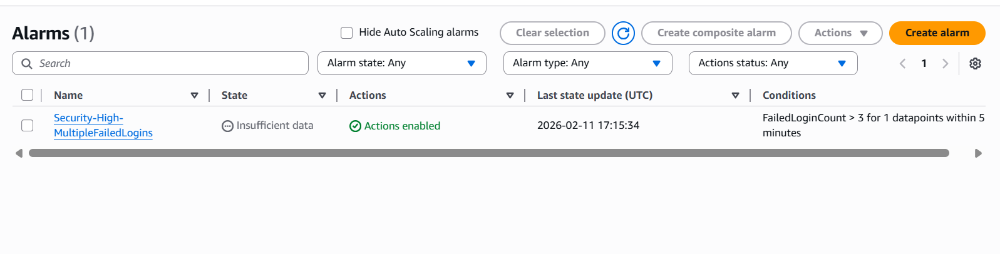

# Module 04: Real-Time Monitoring & Alerting (CloudWatch + SNS) 🚨

## 📋 Overview
Logs are useless if nobody watches them. In this module, I transitioned from "Passive Logging" to **"Active Monitoring"**. I implemented an automated response system that detects suspicious authentication patterns (Brute Force indicators) and notifies the security team in real-time using **AWS SNS**.

## 🎯 Objectives
* **Pattern Recognition:** Filter logs for specific security indicators (IOCs).
* **Automated Alerting:** Trigger notifications without human intervention.
* **Incident Response:** Reduce "Mean Time to Detect" (MTTD) for identity attacks.

## ⚙️ Implementation Details

### 1. Log Ingestion (CloudTrail to CloudWatch)
I configured CloudTrail to stream logs to **CloudWatch Logs** groups to enable low-latency metric extraction.

### 2. Metric Filter (The Pattern)
I defined a custom metric filter to parse JSON logs for failed authentication attempts:
* **Filter Pattern:** `{ ($.eventName = ConsoleLogin) && ($.errorMessage = "Failed authentication") }`
* **Metric Namespace:** `SecurityMetrics`
* **Metric Name:** `FailedLoginCount`

### 3. Alarm Logic (The Trigger)
An alarm was configured to detect thresholds indicative of a brute-force attack:
* **Threshold:** >= 3 failed attempts within 5 minutes.
* **Action:** Publish message to SNS Topic `Security-Alerts-Topic`.

### 4. Notification System
An email subscription was set up to receive immediate alerts. Below is the evidence of a successful simulation (Self-Attack):
---
*Module completed by: Jarvin Navas*
