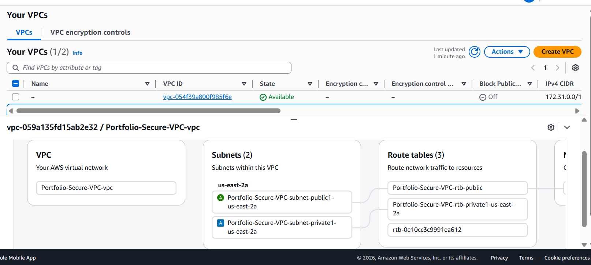
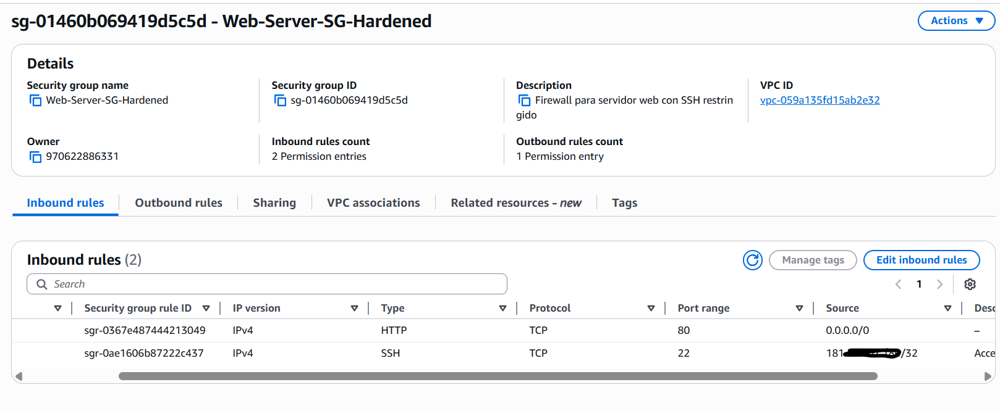

# Module 05: Network Security Architecture (VPC & Firewalls) 🌐

## 📋 Overview
In this module, I moved away from the default AWS network settings to build a **Custom Virtual Private Cloud (VPC)**. The goal was to design a segmented network architecture that isolates resources based on their exposure requirements, following the **Defense in Depth** principle.

## 🎯 Objectives
* **Network Segmentation:** Isolate workloads using public and private subnets.
* **Attack Surface Reduction:** Replace default "Allow All" rules with strict "Least Privilege" firewall rules.
* **Secure Remote Access:** eliminate public exposure of management ports (SSH/RDP).

## ⚙️ Implementation Details

### 1. Custom VPC Architecture
Instead of using the default VPC (which is often too permissive), I architected a new isolated network:
* **CIDR Block:** `10.0.0.0/16` (Private address space).
* **Subnet Strategy:**
    * **Public Subnet:** For resources requiring internet access (e.g., Load Balancers, Bastion Hosts).
    * **Private Subnet:** For backend resources (e.g., Databases) with no direct internet route.

### 2. Hardened Security Groups (Stateful Firewalls)
I configured a custom Security Group (`Web-Server-SG-Hardened`) acting as a virtual firewall for the instances.
* **Rule 1 (Web Traffic):** `HTTP (80)` allowed from `0.0.0.0/0` (Anywhere) to serve content.
* **Rule 2 (Management Traffic):** `SSH (22)` RESTRICTED to **My IP Only**.
    * *Security Impact:* This prevents brute-force attacks and port scanning from the public internet. Access is cryptographically limited to a single authorized physical location.

## 🛡️ Value Added
By implementing this architecture, I demonstrated that **Network Security is the first layer of defense**. Even if an attacker knows the IP address of the server, the Security Group will drop all packets on management ports originating from unauthorized networks, effectively making the management interface invisible to the internet.

---
*Module completed by: Jarvin Navas*
