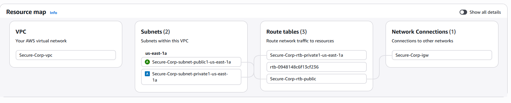

# Module 05: Network Isolation & Virtual Private Cloud (VPC) 🌐

## 📋 Scenario
The "Default VPC" provided by AWS is designed for ease of use, not security. It places all resources in public subnets with direct internet access, which is a major violation of the Principle of Least Privilege. 
To build a secure foundation, I designed a custom VPC architecture from scratch, implementing strict network segmentation.

## 🎯 Objectives
* **Network Segmentation:** Create distinct network tiers (Public vs. Private subnets).
* **Isolation by Default:** Ensure sensitive backend resources (like databases) have zero route to the public internet, protecting them from external inbound attacks.

## ⚙️ Implementation Details & Evidence

### 1. The Secure Architecture (`Secure-Corp` VPC)
I provisioned a custom VPC (`10.0.0.0/16`) containing two distinct subnets:
* **Public Subnet / DMZ:** Configured with a route to an Internet Gateway (IGW). Designed to host internet-facing resources like Application Load Balancers or Bastion Hosts.
* **Private Subnet / Vault:** Configured with a strictly internal route table. It has absolutely no route to the IGW, meaning resources deployed here cannot be reached from the internet, even if their private IPs are leaked.

## 🛡️ Value Added
* **Reduced Attack Surface:** By physically isolating the private subnet at the routing layer, we neutralize threats like port scanning or direct brute-force attacks from external actors against backend servers.
* **Defense in Depth (Layer 3):** This establishes the foundational network perimeter, ensuring that even if application-level firewalls fail, the routing table prevents unauthorized external traffic.

---
*Module completed by: Jarvin Navas*
