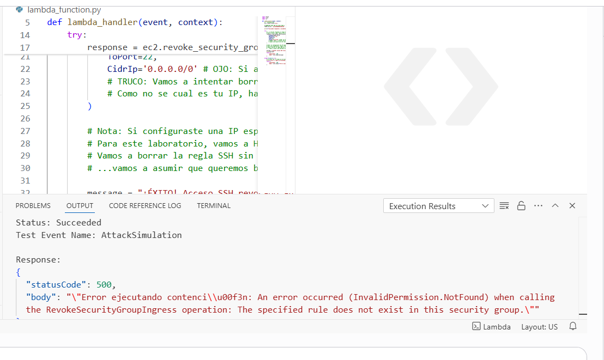
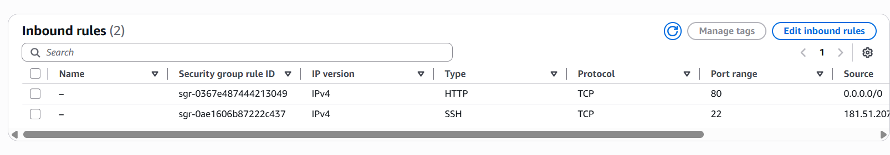

# Module 06: Automated Incident Response (SOAR) 🤖

## 📋 Overview
Manual response involves latency that attackers exploit. In this module, I implemented a **Serverless Incident Response** mechanism using AWS Lambda. This acts as an automated "Kill Switch" that can programmatically modify firewall rules to isolate compromised resources in milliseconds.

## 🎯 Objectives
* **Automated Containment:** Remove management access (SSH) immediately upon trigger.
* **Infrastructure as Code (IaC):** Use Python (Boto3) to interact with the AWS Network API.
* **Reduction of MTTR:** Drastically lower the Mean Time To Respond to network threats.

## ⚙️ Implementation Details

### 1. The Remediation Logic (Python + Boto3)
I developed a Python script deployed on AWS Lambda that targets specific Security Groups.
* **Function:** `Auto-Block-SSH-Incident`
* **Logic:** connect to EC2 API -> Locate Target Security Group -> Revoke Ingress Rule for Port 22.

### 2. IAM Permissions
To allow the script to modify network defenses, I created a Least Privilege IAM Role (`Lambda-Remediation-Role`) granting permission to `ec2:RevokeSecurityGroupIngress`.

### 3. Verification
The automation was tested by simulating an open SSH port (`0.0.0.0/0`). Upon execution, the Lambda function successfully removed the rule, effectively severing potential attacker access.

## 🛡️ Value Added
This demonstrates **SOAR (Security Orchestration, Automation, and Response)** capabilities. Instead of waking up a human engineer to block an IP, the cloud environment self-heals, closing vulnerabilities instantly.

---
*Module completed by: Jarvin Navas*
