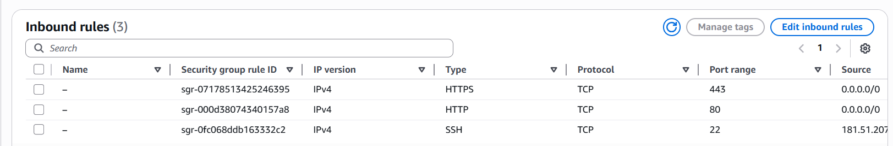

# Module 06: Active Defense & Stateful Firewalls (Security Groups) 🔥

## 📋 Scenario
Deploying resources in a public subnet exposes them to the internet. A common and critical misconfiguration is leaving management ports (like SSH or RDP) open to the world (`0.0.0.0/0`), which immediately invites brute-force attacks and botnet scanning.

## 🎯 Objectives
* **Stateful Firewall Configuration:** Implement AWS Security Groups to control inbound traffic at the instance level.
* **Principle of Least Privilege (Network):** Expose only necessary application ports to the public while strictly whitelisting administrative ports.

## ⚙️ Implementation Details & Evidence

### 1. Web Server Security Group (`Web-Server-SG`)
I created a custom Security Group within the `Secure-Corp` VPC designed for a public-facing web server. 

**The Rule Set:**
* **HTTP (80) & HTTPS (443):** Allowed from `0.0.0.0/0` to ensure global accessibility for web application users.
* **SSH (22):** Strictly restricted to my specific administrative Public IP address (`/32`). This explicitly denies any connection attempts from unauthorized networks.

## 🛡️ Value Added
* **Brute-Force Mitigation:** By whitelisting the SSH port, we eliminate the risk of automated dictionary attacks against the server's remote management interface.
* **Micro-segmentation Foundation:** Security Groups act as a dynamic, instance-level perimeter, providing a second layer of defense even if the broader network routing is compromised.

---
*Module completed by: Jarvin Navas*
