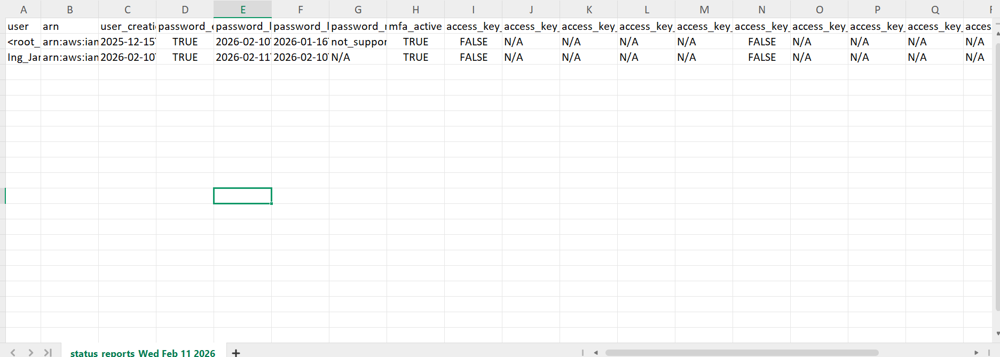
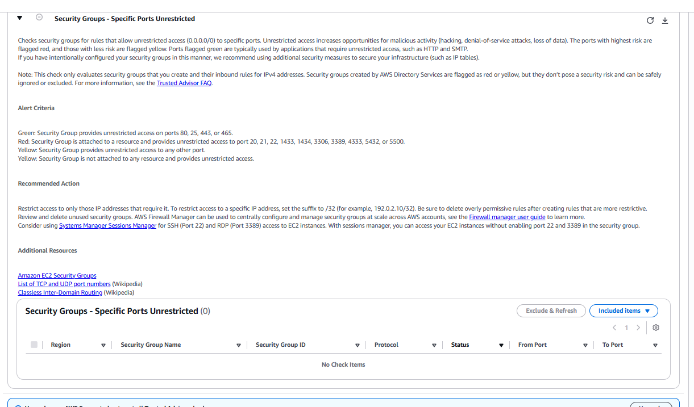

# Module 07: Compliance & Audit Reporting 📋

## 📋 Overview
The final stage of the security lifecycle is **Validation**. In this module, I utilized native AWS auditing tools to verify the security posture of the infrastructure deployed in the previous 6 days.

## 🎯 Objectives
* **Credential Auditing:** Verify MFA enforcement and password rotation across the organization.
* **Security Posture Assessment:** Use AWS Trusted Advisor to validate adherence to best practices.

## ⚙️ Implementation Details

### 1. IAM Credential Report
I generated and analyzed the AWS Credential Report to ensure no unauthorized users exist and that MFA is active for root and admin accounts.

### 2. Trusted Advisor Security Check
I validated the network and identity configuration against AWS best practices.

---
*Project Completed.*
