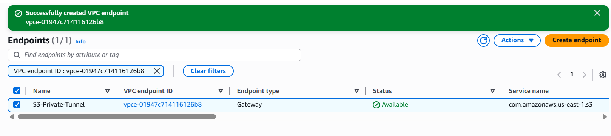

# Module 07: Private Data Exfiltration Prevention (VPC Endpoints) 🚇

## 📋 Scenario
Resources residing in a Private Subnet lack internet access. However, they frequently need to interact with AWS public services like Amazon S3 (e.g., to download secure configurations or upload backend backups). 
The novice approach is to deploy a NAT Gateway, which routes traffic over the public internet. This introduces unnecessary costs and expands the attack surface.

## 🎯 Objectives
* **Private Connectivity:** Establish a secure, private tunnel between the VPC and Amazon S3 without utilizing an Internet Gateway or NAT Gateway.
* **Cost & Security Optimization:** Keep all traffic within the AWS global backbone network to prevent exposure to the public internet and avoid NAT data processing charges.

## ⚙️ Implementation Details & Evidence

### 1. The Gateway Endpoint (`S3-Private-Tunnel`)
I implemented a **VPC Gateway Endpoint** specifically for the Amazon S3 service (`com.amazonaws.us-east-1.s3`). 
I attached this endpoint directly to the Private Subnet's route table. This configuration ensures that whenever a private backend server requests an S3 resource, the traffic is seamlessly routed through the AWS internal network (AWS PrivateLink technology) rather than attempting to traverse the internet.

## 🛡️ Value Added
* **Data Exfiltration Defense:** By keeping traffic off the public internet, we neutralize Man-in-the-Middle (MitM) attacks and external packet sniffing.
* **Compliance:** Meets strict regulatory compliance requirements (like PCI-DSS or HIPAA) that mandate private routing for sensitive data handling.
* **Cost Efficiency:** Eliminates the need for expensive NAT Gateways for AWS service communication.

---
*Module completed by: Jarvin Navas*
