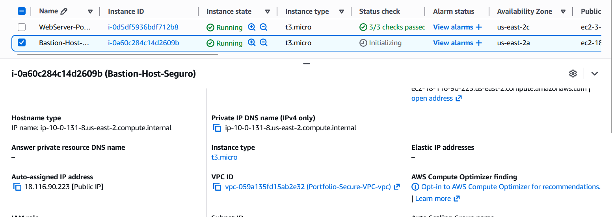

# Module 08: Secure Remote Access (Bastion Host / Jump Box) 🛡️💻

## 📋 Scenario
Backend servers and critical databases must reside in Private Subnets with absolutely no inbound internet access. However, system administrators still require a secure method to connect to these resources for maintenance, patching, or troubleshooting.

## 🎯 Objectives
* **Secure Entry Point:** Deploy a hardened Bastion Host (Jump Box) in the Public Subnet to act as the sole gateway for administrative access.
* **Network Integration:** Properly attach the compute instance to the custom VPC and bind it to the restricted Security Group created in previous modules.

## ⚙️ Implementation Details & Evidence

### 1. Bastion Host Deployment
I provisioned an Amazon EC2 instance (`Bastion-Host-Seguro`) acting as our administrative Jump Box. 
Key architectural configurations include:
* **Placement:** Deployed within the Public Subnet of the custom VPC (`Portfolio-Secure-VPC`), automatically receiving a Public IP address for remote accessibility.
* **Security Binding:** Attached to the `Web-Server-SG` Security Group, meaning the SSH port (22) is completely hidden from the public internet and only accepts connections from a whitelisted administrative IP.

## 🛡️ Value Added
* **Choke Point Control:** Centralizes all administrative access through a single, heavily monitored server, drastically reducing the attack surface.
* **Defense in Depth:** Even if an attacker discovers the private IP of a backend database, they cannot route to it without first compromising the Bastion Host, which is protected by strict firewall rules and SSH key pairs.

---
*Module completed by: Jarvin Navas*
