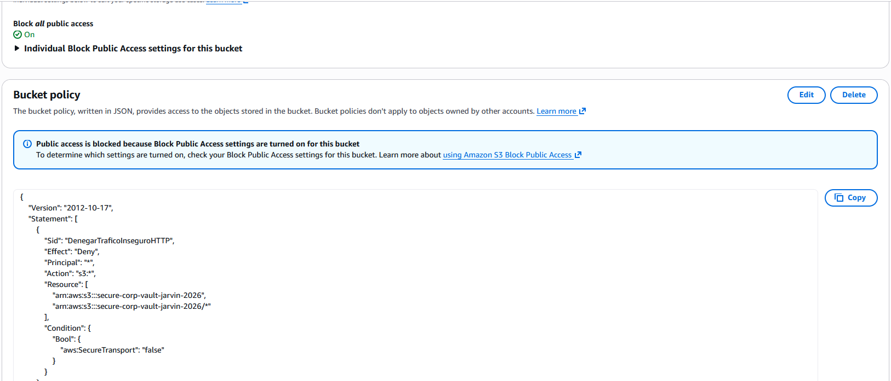

# Module 09: Advanced Data Security & Cryptography (Amazon S3) 🔐

## 📋 Scenario
Data exfiltration and ransomware attacks frequently target misconfigured cloud storage. A common vulnerability is allowing data to be transmitted over unencrypted channels (HTTP) or leaving buckets inadvertently public. 
To secure sensitive corporate data, I implemented a multi-layered defense strategy for Amazon S3, ensuring data is protected both at rest and in transit.

## 🎯 Objectives
* **Public Access Block:** Ensure the bucket can never be made public, regardless of individual object ACLs.
* **Encryption at Rest:** Enforce server-side encryption (SSE-S3) to protect physical storage media.
* **Encryption in Transit:** Implement a strict Bucket Policy that outright denies any API calls made via unencrypted (HTTP) connections.

## ⚙️ Implementation Details & Evidence

### 1. The Secure Data Vault (`secure-corp-vault`)
I provisioned a new S3 bucket with **Block Public Access (BPA)** enabled at the bucket level. To protect against accidental deletion or ransomware overwrites, I also enabled **Bucket Versioning**.

### 2. Enforcing TLS/HTTPS via Bucket Policy
To guarantee data confidentiality while traversing the network, I authored and applied a custom JSON Bucket Policy. 
The policy uses an `Explicit Deny` logic combined with the `aws:SecureTransport` condition key. If a client attempts to upload or download data without using HTTPS, the AWS IAM evaluation engine drops the request.

## 🛡️ Value Added
* **Man-in-the-Middle (MitM) Mitigation:** By forcing HTTPS, we ensure that intercepted traffic cannot be read or tampered with by network sniffers.
* **Regulatory Compliance:** Satisfies strict compliance frameworks (such as HIPAA, SOC2, and PCI-DSS) that mandate end-to-end encryption for sensitive payloads.

---
*Module completed by: Jarvin Navas*
