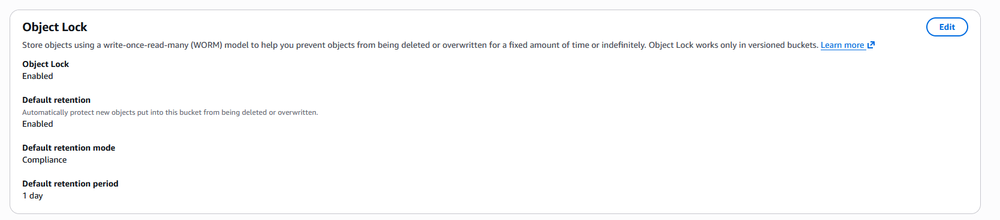

# Module 10: Ransomware Defense & WORM Storage (S3 Object Lock) 🛡️💾

## 📋 Scenario
Even with strict IAM policies and encryption in place, a compromised administrator account or a sophisticated ransomware attack can result in the mass deletion or encryption of critical backups stored in S3. 
To guarantee data immutability, we need a mechanism that supersedes all IAM permissions, including those of the Root user.

## 🎯 Objectives
* **Data Immutability (WORM):** Implement a Write-Once-Read-Many model to ensure critical data cannot be altered or deleted.
* **Ransomware Mitigation:** Create an unbreakable retention policy that protects backups from being held hostage or destroyed by malicious actors.

## ⚙️ Implementation Details & Evidence

### 1. S3 Object Lock (Compliance Mode)
I activated S3 Object Lock on the secure vault bucket. I specifically selected **Compliance Mode** for the default retention period.

**Why Compliance Mode?**
Unlike *Governance Mode* (which allows specific users with special permissions to bypass the lock), *Compliance Mode* is absolute. Once an object is written, it is cryptographically locked by AWS at the storage layer. During the retention period (e.g., 1 day for this lab, typically years for production compliance), **no user, including the AWS Account Root User**, can delete or overwrite the object.

## 🛡️ Value Added
* **Absolute Protection:** Neutralizes the threat of insider sabotage and automated ransomware scripts aiming to destroy cloud backups.
* **Legal Hold Readiness:** Provides the technical foundation required to place digital evidence under "Legal Hold" during forensic investigations, ensuring the chain of custody remains untampered.

---
*Module completed by: Jarvin Navas*
