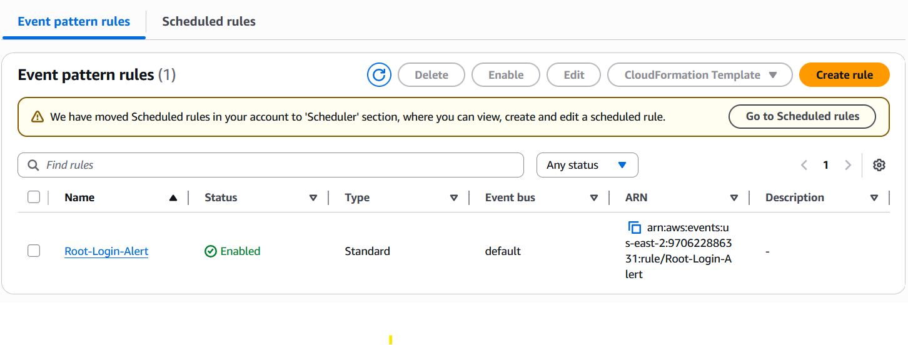

# Module 11: Security Monitoring & Incident Response (SOC) 🚨

## 📋 Scenario
A foundational rule of Cloud Security is that the AWS Root account must never be used for daily tasks. If a login event occurs using the Root credentials, it indicates either a severe policy violation by an internal employee or an active compromise by an external threat actor. Immediate notification is critical.

## 🎯 Objectives
* **Real-time Threat Detection:** Implement a monitoring architecture to detect unauthorized high-privileged access.
* **Automated Alerting:** Route critical security events to an incident response team (via email/SMS) with near-zero latency.

## ⚙️ Implementation Details & Evidence

### 1. The Notification Engine (Amazon SNS)
I established an Amazon Simple Notification Service (SNS) Topic named `Security-Alerts`. I configured an email subscription to act as the endpoint for our Incident Response team, ensuring they receive immediate push notifications.

### 2. The Detection Logic (Amazon EventBridge & CloudTrail)
I deployed an EventBridge Rule (`Root-Login-Alert`) configured with a custom JSON event pattern. This rule acts as a tripwire, constantly filtering API calls logged by AWS CloudTrail. 
The custom JSON explicitly filters for:
* `"source": ["aws.signin"]`
* `"userIdentity": {"type": ["Root"]}`

When a match occurs, EventBridge automatically pushes the event payload to the SNS Topic.

## 🛡️ Value Added
* **Reduced MTTD (Mean Time To Detect):** Reduces the time it takes to discover a critical breach from months to mere seconds.
* **Automated Incident Response:** Forms the foundation of a modern SOC (Security Operations Center), allowing security teams to focus on response rather than manual log parsing.

---
*Module completed by: Jarvin Navas*
