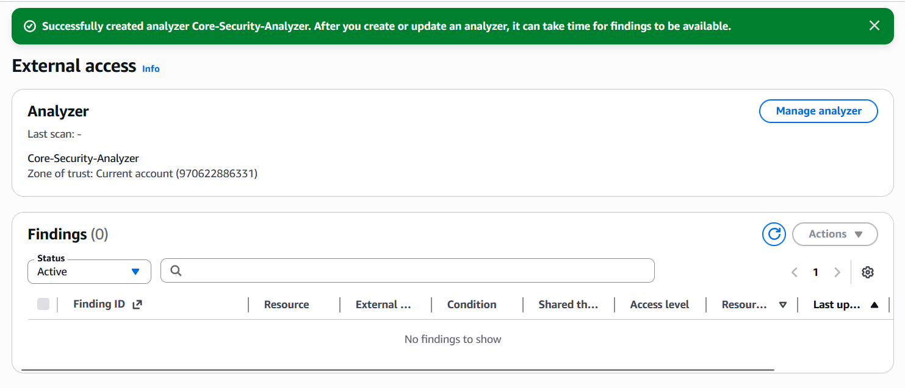

# Module 12: Zero Trust & External Access Auditing (IAM Access Analyzer) 🛡️🔍

## 📋 Scenario
In cloud environments, a single misconfigured resource policy (such as a public S3 bucket or an overly permissive IAM Role) can lead to catastrophic data breaches. Relying solely on manual reviews is inefficient and prone to human error. To guarantee a Zero Trust architecture, we need automated, mathematical proof that no resources are unintentionally exposed to external entities.

## 🎯 Objectives
* **Automated Reasoning:** Utilize AWS IAM Access Analyzer's mathematical logic to proactively scan resource-based policies across the entire account.
* **Attack Surface Reduction:** Identify and remediate any unintended cross-account or public access to critical infrastructure.

## ⚙️ Implementation Details & Evidence

### 1. Zone of Trust Configuration
I deployed an IAM Access Analyzer named `Core-Security-Analyzer` and established the current AWS Account as the absolute **Zone of Trust**. By defining this boundary, the analyzer treats any access granted to an external principal (anyone outside this specific AWS account ID) as a potential security risk.

### 2. Continuous Policy Evaluation
The analyzer continuously evaluates policies attached to supported resources (S3 buckets, IAM roles, KMS keys, Lambda functions, etc.). 
* **Result:** The baseline scan returned **0 Active Findings**. This mathematically proves that the security controls implemented in previous modules (such as S3 Block Public Access) are functioning correctly and no resources are leaking access to the public internet.

## 🛡️ Value Added
* **Provable Security:** Moves beyond "best-effort" security to mathematically verified policy evaluation.
* **Compliance Automation:** Provides the necessary continuous auditing evidence required by strict regulatory frameworks (PCI-DSS, SOC 2) to prove that data perimeters are intact.

---
*Module completed by: Jarvin Navas*
