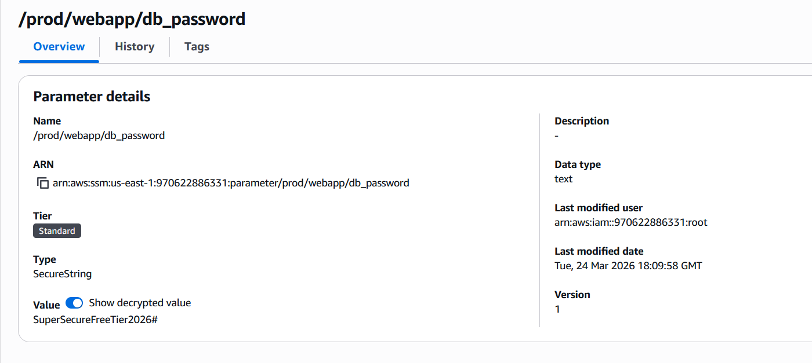

# Module 13: Secure Secret Management (AWS Systems Manager Parameter Store) 🔐

## 📋 Scenario
Hardcoding credentials (usernames, passwords, API keys) directly into application source code is one of the most common and dangerous security vulnerabilities. If code is leaked or pushed to public repositories, these secrets are immediately compromised. To mitigate this risk, we must decouple secrets from the code and store them in a secure, centralized management service.

## 🎯 Objectives
* **Secret Centralization:** Move sensitive configuration data out of the application code and into AWS.
* **Cost-Effective Security:** Leverage AWS Systems Manager Parameter Store (Standard Tier) to achieve secure storage without additional costs.
* **Encryption at Rest:** Ensure sensitive data is handled securely via KMS integration.

## ⚙️ Implementation Details & Evidence

### 1. Centralized Parameter Store
I implemented a hierarchical storage structure using **AWS Systems Manager Parameter Store**. I created a parameter named `/prod/webapp/db_password` to store critical database credentials.

### 2. Decoupling Configuration from Code
By using this service, applications can now fetch credentials at runtime via AWS APIs or SDKs using an IAM Role, rather than storing a plain-text password in a configuration file. This follows the security principle of **Secret Rotation Readiness**.

## 🛡️ Value Added
* **Leak Prevention:** Even if the source code is compromised, the actual credentials remain safe within the AWS security perimeter.
* **Operational Efficiency:** Allows security teams to update passwords/keys in one central location without needing to redeploy or recompile the entire application.

---
*Module completed by: Jarvin Navas*
