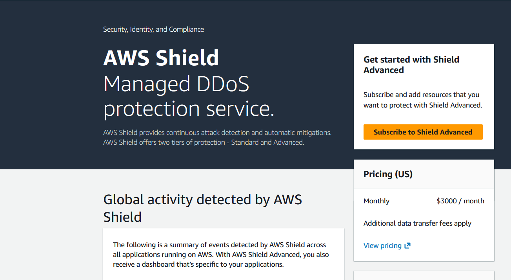

# Module 15: DDoS Protection & Infrastructure Resilience (AWS Shield) 🛡️🌊

## 📋 Scenario
Distributed Denial of Service (DDoS) attacks are designed to overwhelm applications by flooding them with massive amounts of illegitimate traffic. To maintain high availability, cloud infrastructure must have an always-on detection and mitigation layer that operates at the network and transport layers (Layers 3 and 4).

## 🎯 Objectives
* **Infrastructure Hardening:** Understand the baseline protection provided by AWS against common volumetric attacks.
* **Perimeter Security:** Recognize the difference between automated network protection (Shield Standard) and advanced application-layer protection (Shield Advanced).

## ⚙️ Implementation Details & Evidence

### 1. AWS Shield Standard Implementation
By default, all AWS customers are protected by **AWS Shield Standard** at no additional cost. This service provides automatic protection against the most common, frequently occurring network and transport layer DDoS attacks (such as SYN floods or Reflection attacks).

### 2. Monitoring Global Threat Intelligence
I accessed the AWS Shield dashboard to verify the status of the account's managed protection. While "Shield Advanced" features (Global Threat Dashboards) are restricted to premium subscriptions, the foundational "Standard" tier remains active, protecting all public-facing endpoints (ELB, CloudFront, Route 53) from large-scale outages.

## 🛡️ Value Added
* **Always-On Defense:** Ensures that the underlying AWS infrastructure is resilient against mass-scale attacks without requiring manual intervention.
* **Cost-Efficient Availability:** Leverages AWS's global network scale to drop malicious traffic at the edge before it affects the operational budget.

---
*Module completed by: Jarvin Navas*
